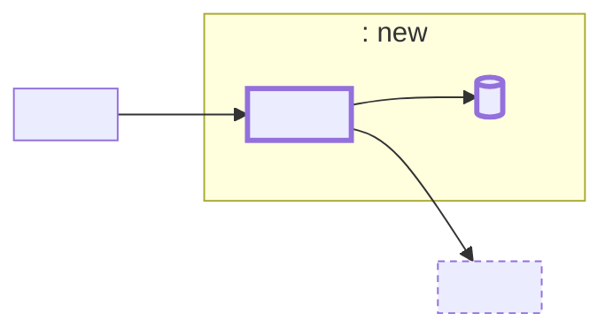
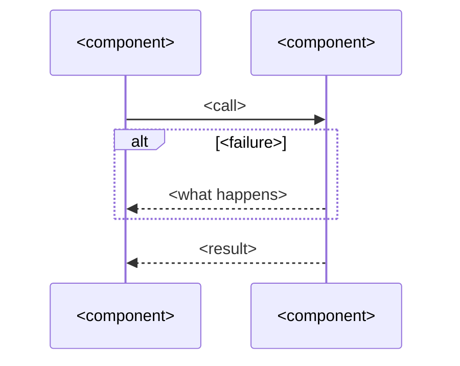

# Shape doc template

Keep the prose under about 60 lines; diagrams don't count. If it runs over, trim Alternatives considered and Not building first. Use the shape's own vocabulary, and define each domain term where it first appears. List items are sentences with a bold subject, not `term — definition` pairs.

````md
# <Feature> solution shape

<The pitch: one or two plain sentences on what changes and why.>

<!-- Only when the pitch uses terms it can't define in place: at most three, as prose. -->
Terms: a **<term>** is <meaning>.

## Components



Thick border: new or changed. Dashed: exists today. Labeled arrows are the seams.

**<module>** (<new | changed | existing>) <one sentence on what the module is responsible for>.

- **<component>** <does what it owns, plus anything the diagram can't show: purity, who logs, lifetime, source of truth>.

## Sequence



1. **<Phase>.** <What happens, which component does it, and what happens on failure at this step.>

## Alternatives considered

- **<Option>.** <Why it was ruled out.>

## Not building

- **<Item>.** <What would make it worth building.>

## Open questions

- <Question> Owner: <named person, team, spike, or planning>.
````
