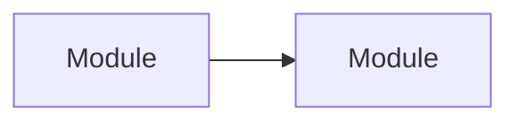

# Shape doc template

Keep the whole document under about 60 lines. Use the vocabulary from step 1 throughout.

````md
# <Feature> — solution shape

<Two or three lines: the problem, and what this shape commits to.>

## Vocabulary

- **<term>** — <meaning in this domain>

## Components



Arrows point from the depender to the dependency.

## Responsibilities

- **<Module>** — <one sentence, no "and">

## Seams

- **<Seam>** — <what can vary behind it, and why the seam sits here>

<!-- Include each of the next four only when it applies. -->

## Ownership

- **<Concern>** — owned by <Module>

## Config surface

- **<VAR_OR_FLAG>** — <why it isn't hardcoded>

## Boundary failures

- **<Seam or input>** — <behaviour>

## Not building

- <Deferred item> — <what would make it worth building>

## Decisions

- **<Decision>** — <chosen option>. Rejected: <option> (<why>). Decided by <user | Claude-recommended, user agreed>, <YYYY-MM-DD>.

## Open questions

- **<Question>** — owner: <user | planning | named person>
````
